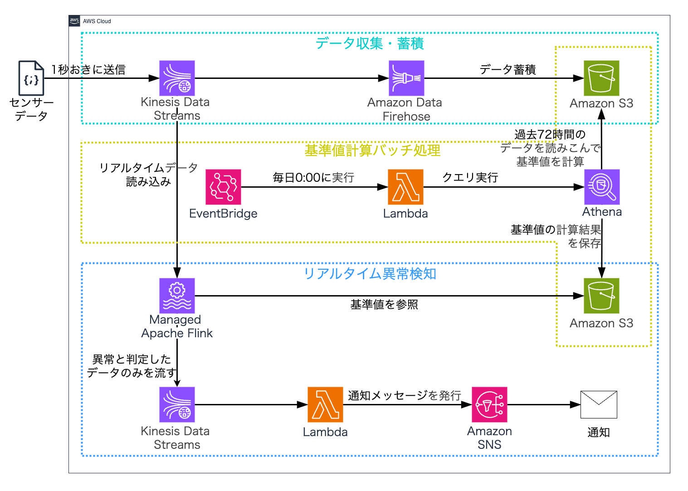

# AWS Real-time Anomaly Detection System

AWSのマネージドサービスを活用した、時系列データのリアルタイム異常検知システムです。
製造ラインのセンサーデータ等を想定し、直近のデータ傾向から動的に「異常判定の基準値」を毎日計算。ストリームデータに対してリアルタイムに品質監視を行います。

## 概要

本システムは、以下のフローで**Serverless & Managed**な異常検知を実現します。

1.  **データ収集・蓄積**: 高頻度データをリアルタイム収集し、データレイク(S3)へ蓄積。
2.  **動的基準値計算**: 直近72時間の蓄積データを基に、統計的基準値（平均・標準偏差・管理限界）を毎日自動計算。
3.  **リアルタイム検知**: 計算された基準値を用いて、流れてくるデータに対しManaged Apache Flinkで異常判定。
4.  **即時通知**: 異常検知時は即座にアラートを通知。

## アーキテクチャ



### 使用技術スタック

| カテゴリ         | サービス                 | 用途                              |
| ---------------- | ------------------------ | --------------------------------- |
| **Ingestion**    | **Kinesis Data Streams** | ストリームデータの受け口          |
|                  | **Amazon Data Firehose** | S3へのデータ永続化                |
| **Storage**      | **Amazon S3**            | データレイク（生データ・基準値）  |
| **Batch**        | **AWS Lambda**           | 基準値計算ロジックの実行          |
|                  | **Amazon Athena**        | S3データの集計（SQL）             |
|                  | **Amazon EventBridge**   | 定期実行スケジューラ              |
| **Streaming**    | **Managed Apache Flink** | リアルタイム異常検知（Flink SQL） |
| **Notification** | **Amazon SNS**           | アラート通知（Email等）           |

## 異常検知ロジック (SPC)

本システムでは、統計的工程管理（SPC）の考え方に基づき、以下の2種類の異常を検知します。
製品（`product_id`）ごとに直近72時間のデータを集計し、平均 $\mu$・標準偏差 $\sigma$ を算出します。

### 1. 個別値検知 (Individuals)

突発的な異常値を検知します。

- 上方管理限界: $UCL = \mu + 3\sigma$
- 下方管理限界: $LCL = \mu - 3\sigma$
- **判定**: 個々の測定値がこの範囲を超えた場合 → `Provisional` (暫定異常)

### 2. X-bar管理図 (平均値検知)

平均的なズレを検知します（5点移動平均）。

- 上方管理限界: $UCL = \mu + 3\frac{\sigma}{\sqrt{5}}$
- 下方管理限界: $LCL = \mu - 3\frac{\sigma}{\sqrt{5}}$
- **判定**: 5点ごとの移動平均がこの範囲を超えた場合 → `Confirmed` (確定異常)

## データフォーマット

### 入力データ (Kinesisへの投入形式)

```json
{
  "timestamp": "2026-02-17 12:00:34",
  "machine_id": "M-001",
  "product_id": "B205",
  "thickness": 49.86,
  "line_speed": 50.2
}
```

### 基準値データ (S3上のNDJSON)

Athenaで計算され、Flinkが参照するマスタデータです。

```json
{
  "product_id": "B205",
  "date_key": "2026-02-17",
  "mean": 50.0,
  "std_dev": 0.5,
  "ucl_i": 51.5,
  "lcl_i": 48.5,
  "ucl_x": 50.67,
  "lcl_x": 49.33
}
```

### 異常検知結果 (出力Kinesis)

```json
{
  "AnomalyType": "Confirmed",
  "TargetTime": "2026-02-17 12:00:58",
  "MeasuredValue": 48.75,
  "UpperLimit": 49.33,
  "BaselineRef": "2026-02-17",
  "ProductId": "B205"
}
```

## ディレクトリ構成

```text
.
├── data_ingestion/
│   └── send_data_to_kds.py      # データ生成・Kinesis送信スクリプト
├── batch_calculation/
│   ├── athena_table_ddl.sql    # Athenaテーブル定義
│   └── calculate_limits.py     # 基準値計算用Lambda関数
├── realtime_detection/
│   ├── flink_notebook.sql      # Managed Flink Studio Notebook用SQL
│   └── notify_alert.py         # 通知用Lambda関数
├── images/
│   └── architecture.png        # アーキテクチャ図
└── README.md
```

## セットアップとデプロイ

前提条件: AWS CLIが設定済みであること、Python 3.12環境があること。

### 1. データ収集・蓄積基盤の構築

```bash
# 変数設定
BUCKET_NAME="your-unique-bucket-name"
REGION="ap-northeast-1"

# S3バケット作成
aws s3 mb s3://${BUCKET_NAME} --region ${REGION}

# Kinesis Data Streams作成 (入力用)
aws kinesis create-stream --stream-name spc-input-stream --shard-count 1

# Kinesis Data Streams作成 (出力用)
aws kinesis create-stream --stream-name spc-output-stream --shard-count 1
```

※ Firehoseの作成はAWSコンソールから「Source: Kinesis」「Destination: S3」で設定してください。

### 2. Athenaテーブル定義

S3に蓄積されたデータをクエリ可能にするため、Athenaでテーブルを作成します。

```sql
CREATE EXTERNAL TABLE IF NOT EXISTS coating_data (
  `timestamp` string,
  `thickness` double,
  `product_id` string
)
PARTITIONED BY (datehour string)
ROW FORMAT SERDE 'org.openx.data.jsonserde.JsonSerDe'
LOCATION 's3://YOUR_BUCKET_NAME/raw-data/'
TBLPROPERTIES (
  'projection.enabled' = 'true',
  'projection.datehour.format' = 'yyyy/MM/dd/HH',
  'projection.datehour.type' = 'date',
  'projection.datehour.range' = '2024/01/01/00,NOW',
  'projection.datehour.interval' = '1',
  'projection.datehour.interval.unit' = 'HOURS',
  'storage.location.template' = 's3://YOUR_BUCKET_NAME/raw-data/${datehour}/'
);
```

### 3. 基準値計算バッチ (Lambda)

1.  `batch_calculation/calculate_limits.py` をLambda関数としてデプロイします。
2.  **レイヤー**: `AWSSDKPandas-Python312` を追加してください。
3.  **EventBridge**: 毎日0:00 (JST) にトリガー設定します。

### 4. リアルタイム検知 (Managed Flink)

1.  Kinesis Data Analytics Studio (Notebook) を作成します。
2.  `realtime_detection/flink_notebook.sql` の内容をコピーし、実行します。
3.  S3上の基準値ファイルとストリームデータをJOINする設定を確認してください。

## 使用方法

ローカル環境からダミーデータを生成してAWSへ送信し、動作を確認します。

```bash
# 必要なライブラリのインストール
pip install boto3 pandas

# スクリプトの実行 (Ctrl+Cで停止)
python data_ingestion/send_data_to_kds.py
```

## 今後の展望

- Terraform/AWS CDKによるIaC化
- Amazon QuickSightを用いたダッシュボードによる可視化
- CI/CDパイプラインの構築
